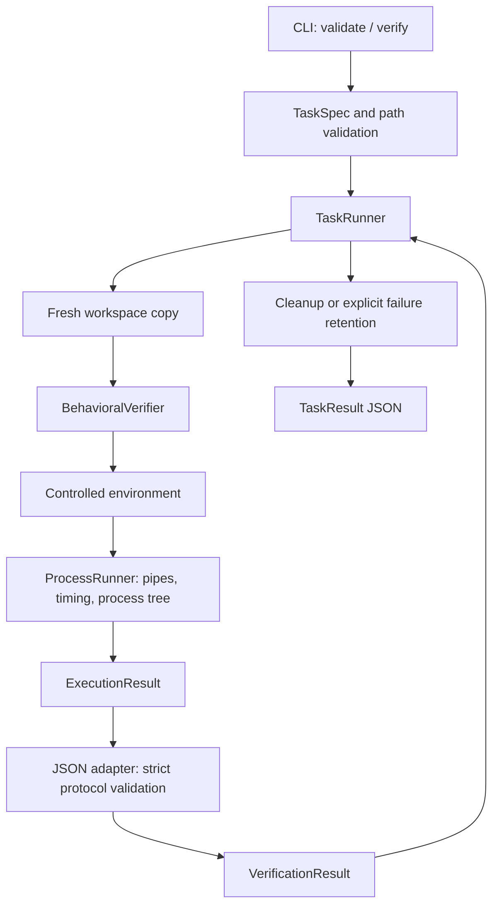

# Long Horizon SWE Lab

An independent software-engineering project exploring reproducible evaluation of multi-step repository-level coding workflows.

Repository-level work moves between investigation, implementation, and testing. A unit-test harness checks assertions; a workflow evaluator also needs explicit task contracts, disposable workspaces, process cleanup, and measured diagnostics explaining failures.

**Implemented:** validated manifests, lifecycle/result models, copied workspaces, bounded subprocess execution, timeout cleanup, a controlled environment, and an explicit JSON verifier protocol. `long-swe verify` executes an operator-trusted verifier in a fresh copy and returns measured results.

```sh
git clone https://github.com/akashk0702/long-horizon-swe-lab.git
cd long-horizon-swe-lab
uv sync --locked
uv run --locked pytest
uv run --locked long-swe validate path/to/task.yaml
uv run --locked long-swe verify path/to/task.yaml
```

Use Python 3.12 and [uv](https://docs.astral.sh/uv/getting-started/installation/). Supply your own trusted manifest and verifier following the [task format](docs/task-format.md) and [verifier protocol](docs/verifier-protocol.md). Plain pytest console output is not this JSON protocol.

The framework provides deterministic evaluation contracts and controlled execution; determinism of evaluated programs remains task-dependent. Local subprocesses are **not a security sandbox**. Read [SECURITY.md](SECURITY.md) before running commands.

## Overview

Each verification copies the source repository, creates fresh home/temp directories, runs the declared verifier, interprets its captured protocol output, constructs a measured result, and cleans up. The framework's copy/cleanup operations do not write to the source. Evaluated programs still have the host user's permissions.

## Architecture



See [architecture and ownership](docs/architecture.md). Process management does not parse verifier messages; the adapter does not create subprocesses; the coordinator does not format CLI output.

## Task Lifecycle

`PENDING → INSPECTING → TESTING → COMPLETED / FAILED` is the verification-only path. The domain model also permits implementation, feedback, and retry transitions. This milestone does not coordinate arbitrary implementation commands or persist events.

## Execution Model

- Fresh working copy per run; Git metadata, virtual environments, tool caches, and environment files are excluded.
- Links, Windows reparse points, and special files are rejected during copying; file/byte copy limits are configurable.
- Explicit argument arrays, `shell=False`, explicit cwd, closed stdin, controlled environment, and observed exit codes.
- POSIX process-group cleanup; Windows suspended launch into a kill-on-close Job Object.
- Bounded stdout/stderr prefixes, UTF-8 diagnostics, explicit truncation flags, and measured durations.
- Cleanup after success/failure; `--retain-on-failure` preserves failed runs for debugging.

See [process and environment semantics](docs/execution.md) for limits and OS behavior.

## Verification

The JSON adapter requires exactly one versioned document from the **executed, operator-trusted verifier**. It rejects missing fields, duplicate keys, unsupported versions, contradictory counts, extra stdout, invalid UTF-8 stdout, truncation, timeouts, and success paired with a nonzero exit.

Workspace report files and human test summaries are not evidence sources. Unobserved counts are `null`, never invented zeroes. Completion requires passing final verification. Protocol validity cannot establish that a candidate-authored verifier is trustworthy; verifier code and assertions must be operator-controlled.

## Trace & Replay

Deferred. There is no trace persistence, replay command, or simulated execution history.

## Example Tasks

Deferred. No sample engineering repository, reference implementation, or benchmark is included. Tests create temporary fixtures for execution and protocol behavior only.

## Testing

```sh
uv sync --locked
uv run --locked ruff check .
uv run --locked ruff format --check .
uv run --locked mypy
uv run --locked pytest
uv build --no-sources
```

CI runs on Linux and Windows with Python 3.12. Tests exercise actual subprocesses, descendant cleanup, bounded output, arguments, environment filtering, unchanged source contents, retention, CLI behavior, and protocol rejection. Symlink tests skip only when Windows denies link creation; Linux CI exercises them. Platform-specific tests skip on the other OS. Core tests use no network APIs.

## Design Decisions

- Separate process execution, protocol interpretation, and workspace lifetime.
- Fail closed when process ownership or complete verifier evidence cannot be established.
- Resolve executables explicitly; reject Windows batch files to avoid implicit shell invocation.
- Allowlist parent environment inputs; task parameters use validated `TASK_` names.
- Keep strict contracts without claiming arbitrary external programs are deterministic.
- New capture flags default to false; unknown test counts have explicit null values.

## Limitations

No VM/container isolation, hostile-code containment, network restriction, general write enforcement, trace/replay, scoring, automatic dependency installation, or sample tasks exist. `run` and `replay` are unavailable. `allowed_paths` is validated but is not an OS write policy. Source trees must remain stable during copying. Tools and verifiers retain host permissions and network access.

Only Python 3.12 on Linux and Windows is tested. Timing depends on host load; OS process startup is not always interruptible. Detached POSIX processes can escape group cleanup. See [SECURITY.md](SECURITY.md) and [execution limitations](docs/execution.md#limitations).

## Local Setup

`uv sync --locked` creates the development environment from `uv.lock`; the first sync needs downloads. CI uses uv 0.11.28. A source workspace's virtual environment is not copied; required verifier dependencies must already be installed in the chosen interpreter/tool environment.

```sh
uv run --locked long-swe verify path/to/task.yaml --retain-on-failure
uv run --locked long-swe verify path/to/task.yaml --max-stdout-bytes 1048576 --max-stderr-bytes 262144
```

`validate` never executes commands. `verify` returns TaskResult JSON on stdout and exits 0 for completion or 1 for run/verification failure. Configuration errors use stderr and exit 2.

Licensed under the [MIT License](LICENSE). Independent project by Akash Kumar.
