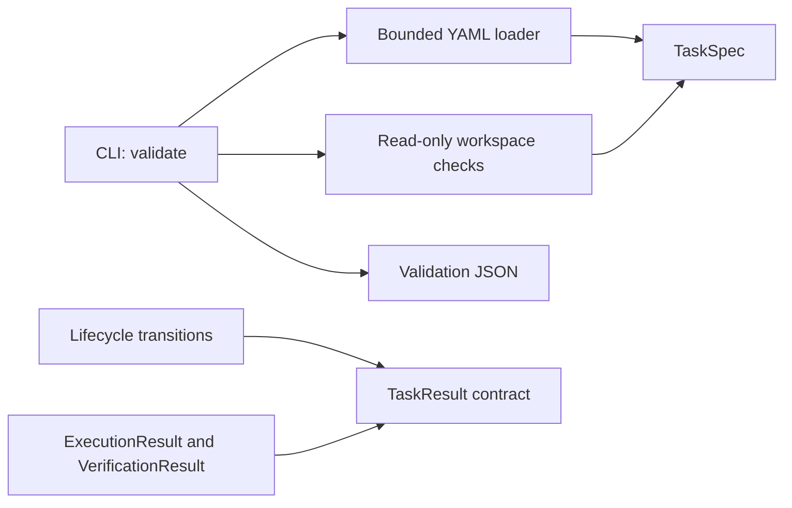

# Long Horizon SWE Lab

An independent software-engineering project exploring reproducible evaluation of multi-step repository-level coding workflows.

The goal is to evaluate work that moves between investigation, implementation, and testing while retaining enough evidence to explain the final outcome. A unit-test harness answers whether assertions pass; repository-level workflows also need an explicit task contract, controlled execution, failure recovery, and a record of the work performed.

**Current milestone: foundation.** Implemented: validated task manifests, lifecycle transitions, typed outcome contracts, workspace path checks, and a `validate` CLI. Command execution, behavioral verification, trace recording, replay, and sample engineering tasks are **not implemented yet**. The models describe outcomes; they do not generate measured results.

```sh
git clone https://github.com/akashk0702/long-horizon-swe-lab.git
cd long-horizon-swe-lab
uv sync --locked
uv run --locked long-swe --help
uv run --locked pytest
```

Python 3.12 and [uv](https://docs.astral.sh/uv/getting-started/installation/) are required. Correctness of the current foundation is checked through unit tests and filesystem/CLI integration tests, with Ruff, strict mypy, and CI on Linux and Windows.

## Overview

A task declares a starting workspace, an argument vector for verification, a timeout, and writable paths. Domain contracts stay independent of filesystem I/O and CLI formatting. This makes it possible to add execution and verifier adapters without putting process management into task definitions.

## Architecture



```text
src/long_horizon_swe/
  core/     task, state, result, shared types, exceptions
  config/   YAML loading and filesystem path resolution
  cli/      argument parsing and validation output
tests/      contract, lifecycle, filesystem, and CLI tests
docs/       architecture decisions and task format
```

[Architecture decisions](docs/architecture.md) describe the extension boundaries. Unimplemented packages are intentionally absent.

## Task Lifecycle

The states are `PENDING`, `INSPECTING`, `IMPLEMENTING`, `TESTING`, `FAILED`, and `COMPLETED`; their serialized values are lowercase. Work can return from implementation to investigation and from testing to implementation. Failure can retry through investigation. Completion is terminal and requires passing final verification in a `TaskResult`.

The transition function validates one step; it does not persist state, count retries, or create events. See the [transition table](docs/architecture.md#lifecycle-rules).

## Execution Model

The current `ExecutionResult` contract records command arguments, an observed exit code, stdout, stderr, duration in milliseconds, and timeout status. A timed-out command cannot be successful even if its recorded exit code is zero. A launch failure must not be disguised as an invented process exit code.

Future execution work will need workspace copying, process cleanup, measured timeouts, bounded output capture, and explicit environment configuration. **Path validation is not process isolation or a security sandbox.** This version never executes a manifest command.

## Verification

`VerificationResult` requires observed test counts and diagnostics for failure. Passing requires exit code zero, at least one passing test, and zero failed tests. A successful process exit alone is insufficient. `TaskResult` rejects completion without passing verification.

These are data consistency checks, not a behavioral verifier. No test-output parser, reward function, tampering detector, or determinism guarantee for external programs is implemented. Future verifiers must judge behavior using actual tests.

## Trace & Replay

Planned: JSONL events captured at real execution boundaries and a replay command that renders saved evidence without rerunning commands. This milestone has no trace writer or replay command and publishes no simulated execution history.

## Example Tasks

The multi-module feature, regression debugging, and performance optimization tasks are deferred to a later milestone. No sample repository, reference implementation, or benchmark result is included yet. The [manifest format](docs/task-format.md) contains a configuration illustration only.

## Testing

```sh
uv sync --locked
uv run --locked ruff check .
uv run --locked ruff format --check .
uv run --locked mypy
uv run --locked pytest
uv build --no-sources
```

Tests cover invalid fields and paths, ambiguous YAML, manifest limits, result contradictions, lifecycle feedback and recovery, symlink containment, JSON round trips, installed entry points, and the guarantee that validation does not run a command. Core tests require no network APIs. Symlink integration tests skip with an explicit reason if the host denies symlink creation; CI also runs on Linux.

## Design Decisions

- Argument arrays preserve quoting and empty arguments; shell strings are rejected.
- Relative, portable paths avoid dependence on the invoking shell's working directory. Writable roots are explicit files or directories, not glob patterns.
- YAML loading rejects duplicate keys and aliases rather than silently changing a contract.
- Domain validation is separate from disk access. `load_task` parses; `resolve_workspace` checks the filesystem.
- Outcomes cannot claim success using contradictory exit codes or test counts.
- Pinned dependencies in `uv.lock` reproduce the development environment. CI actions use immutable commit references and read-only repository permissions.

## Limitations

- This is a foundation release, not a working evaluation engine. `run`, `verify`, and `replay` are unavailable.
- No isolation, timeout enforcement, environment normalization, command allowlist, or writable-path enforcement exists yet.
- Path checks describe the filesystem at validation time. They do not prevent later symlink changes or hostile processes.
- Models reject attribute reassignment, but nested metadata is not deeply immutable. Treat loaded contracts as snapshots and validate again at future execution boundaries.
- Python 3.12 is the supported interpreter line. Other versions are not currently claimed to work.
- No performance or evaluation results have been produced.

## Local Setup

`uv sync --locked` installs the package in an isolated virtual environment using the committed lockfile. The first sync needs network access for dependencies; the test suite itself runs locally. CI uses uv 0.11.28.

To validate your own manifest and existing workspace:

```sh
uv run --locked long-swe validate path/to/task.yaml
```

Successful validation writes one JSON object to stdout and exits zero. Configuration and workspace errors write one JSON object to stderr and exit 2. Argument usage errors use argparse's standard text diagnostics and exit 2. Validation reports schema and path validity only; it does not report test results. See [task format and command behavior](docs/task-format.md).

Licensed under the [MIT License](LICENSE). Independent project by Akash Kumar.
