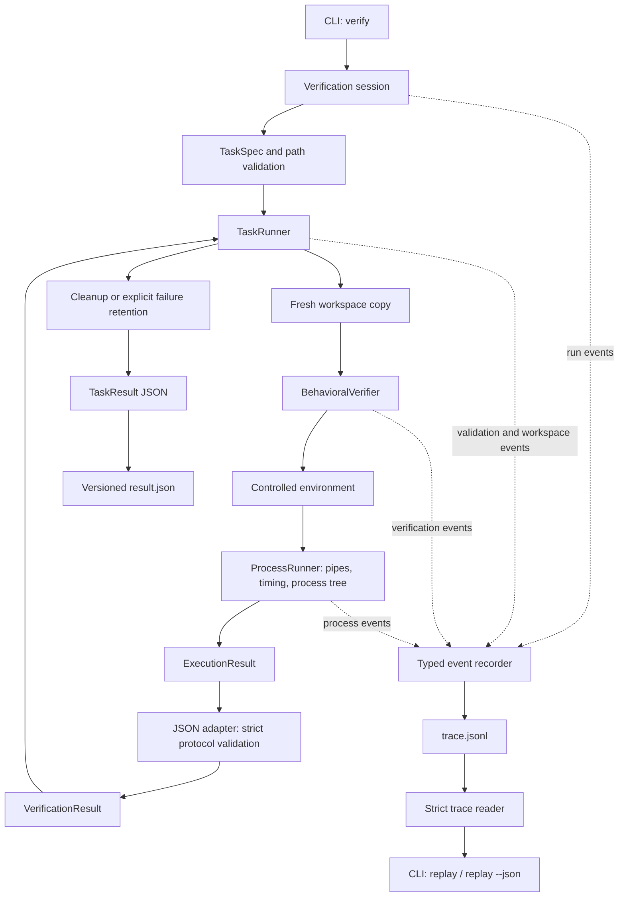

# Long Horizon SWE Lab

An independent software-engineering project exploring reproducible evaluation of multi-step repository-level coding workflows.

Repository-level work moves between investigation, implementation, and testing. A unit-test harness checks assertions; a workflow evaluator also needs explicit task contracts, disposable workspaces, process cleanup, and measured diagnostics explaining failures.

**Implemented:** validated manifests, copied workspaces, bounded subprocess execution, timeout cleanup, a controlled environment, a strict JSON verifier protocol, and structured trace/replay. Original tasks exercise [multi-module feature implementation](examples/tenant-quota-service/README.md) and [root-cause regression debugging](examples/routing-cache-regression/README.md) against functional services.

```sh
git clone https://github.com/akashk0702/long-horizon-swe-lab.git
cd long-horizon-swe-lab
uv sync --locked
uv run --locked pytest
uv run --locked long-swe validate path/to/task.yaml
uv run --locked long-swe verify path/to/task.yaml
uv run --locked long-swe replay path/to/run/trace.jsonl
```

Use Python 3.12 and [uv](https://docs.astral.sh/uv/getting-started/installation/). Supply your own trusted manifest and verifier following the [task format](docs/task-format.md) and [verifier protocol](docs/verifier-protocol.md). Plain pytest console output is not this JSON protocol.

The framework provides deterministic evaluation contracts and controlled execution; determinism of evaluated programs remains task-dependent. Local subprocesses are **not a security sandbox**. Read [SECURITY.md](SECURITY.md) before running commands.

## Overview

Each verification copies the source repository, creates fresh home/temp directories, runs the declared verifier, interprets its captured protocol output, constructs a measured result, and cleans up. A recorder observes operations as they happen and saves evidence outside the source and copied workspaces. The framework's copy/cleanup operations do not write to the source. Evaluated programs still have the host user's permissions.

## Architecture



See [architecture and ownership](docs/architecture.md). Process management does not parse verifier messages; the adapter does not create subprocesses; the recorder does not decide behavioral success. `validate` uses configuration checks only.

## Task Lifecycle

`PENDING → INSPECTING → TESTING → COMPLETED / FAILED` is the verification-only path. The domain model also permits implementation, feedback, and retry transitions. This milestone records verification operations; it does not coordinate arbitrary implementation commands.

## Execution Model

- Fresh working copy per run; Git metadata, virtual environments, tool caches, and environment files are excluded.
- Links, Windows reparse points, and special files are rejected during copying; file/byte copy limits are configurable.
- Explicit argument arrays, `shell=False`, explicit cwd, closed stdin, controlled environment, and observed exit codes.
- POSIX process-group cleanup; Windows suspended launch into a kill-on-close Job Object.
- Bounded stdout/stderr prefixes, UTF-8 diagnostics, explicit truncation flags, and measured durations.
- Cleanup after success/failure; `--retain-on-failure` preserves failed runs for debugging.

See [process and environment semantics](docs/execution.md) for limits and OS behavior.

## Verification

The JSON adapter requires exactly one versioned document from the **executed, operator-trusted verifier**. It rejects missing fields, duplicate keys, unsupported versions, contradictory counts, extra stdout, invalid UTF-8 stdout, truncation, timeouts, and success paired with a nonzero exit.

Workspace report files and human test summaries are not evidence sources. Unobserved counts are `null`, never invented zeroes. Completion requires passing final verification. Protocol validity cannot establish that a candidate-authored verifier is trustworthy; verifier code and assertions must be operator-controlled.

## Trace & Replay

Replay reads stored evidence and never reruns the original command. Every trace record has a schema version, UUID4 run identifier, contiguous sequence, UTC timestamp, monotonic elapsed milliseconds, explicit event type, and typed payload.

```sh
uv run --locked long-swe verify path/to/task.yaml --output-root path/outside/task-directory
uv run --locked long-swe replay path/outside/task-directory/RUN_ID/trace.jsonl
uv run --locked long-swe replay path/outside/task-directory/RUN_ID/trace.jsonl --json
```

By default, run artifacts persist under the system temporary directory's `long-swe-runs/RUN_ID/`. `verify` prints their location to stderr while keeping TaskResult JSON on stdout. Traces omit command arguments, environment values, raw output, and host paths. The separate `result.json` preserves exact bounded result diagnostics and may contain sensitive data. Neither artifact expires automatically.

The reader validates every line and rejects corruption with a line number. A complete prefix without a terminal event is labeled incomplete. See [trace schema, failure evidence, and privacy](docs/tracing.md).

## Example Tasks

**[Tenant quota feature — multi-module feature implementation](examples/tenant-quota-service/README.md).** Add per-tenant active-job quotas while preserving job scheduling, snapshots, ordering, and API compatibility.

The baseline repository is functional and passes its 11 existing tests; the requested quota feature is absent. Fourteen evaluator-owned behavioral cases live outside the starting workspace. A three-file reference overlay validates task solvability only; the verifier judges behavior rather than code similarity. Five deliberately weak temporary variants are rejected by task-quality checks.

**[Routing cache regression — root-cause debugging](examples/routing-cache-regression/README.md).** Repair stale hierarchical route resolution after runtime configuration changes. The baseline passes 10 developer tests but fails 14 of 17 external behavioral cases. A two-file reference and a different conservative repair both pass all 17 cases; six incomplete repairs are rejected. Candidate instructions describe symptoms and compatibility without prescribing the fix.

```sh
uv run --locked long-swe verify examples/tenant-quota-service/task.yaml
uv run --locked pytest tests/test_tenant_quota_task.py -v
uv run --locked long-swe verify examples/routing-cache-regression/task.yaml
uv run --locked pytest tests/test_routing_regression_task.py -v
```

Both `verify` commands are expected to exit 1 on their unmodified baselines. Follow each task's README to prepare a working copy or validate its reference. `uv sync --locked` installs the separate local evaluators as development dependencies; they are outside candidate workspaces and the framework runtime wheel.

## Testing

```sh
uv sync --locked
uv run --locked ruff check .
uv run --locked ruff format --check .
uv run --locked mypy
uv run --locked pytest
uv build --no-sources
```

CI runs on Linux and Windows with Python 3.12. Tests exercise actual subprocesses, descendant cleanup, bounded output, environment filtering, unchanged source contents, retention, protocol rejection, trace corruption, failed-run evidence, atomic artifact replacement, and replay without execution. Separate task-validation steps check each baseline, reference, repeated verdicts, weak implementations, and evaluator ownership. Routing checks also accept a different correct repair. Symlink tests skip only when Windows denies link creation; Linux CI exercises them. Platform-specific tests skip on the other OS. Tests use no network APIs.

## Design Decisions

- Separate process execution, protocol interpretation, and workspace lifetime.
- Fail closed when process ownership or complete verifier evidence cannot be established.
- Resolve executables explicitly; reject Windows batch files to avoid implicit shell invocation.
- Allowlist parent environment inputs; task parameters use validated `TASK_` names.
- Keep strict contracts without claiming arbitrary external programs are deterministic.
- Additive byte counters default to null for older results; newly executed processes report observed counts.
- Record metadata at operation boundaries; never reconstruct missing events from a final result.
- Keep recording failures separate from behavioral verdicts and surface incomplete evidence explicitly.

## Limitations

No VM/container isolation, hostile-code containment, network restriction, general write enforcement, scoring, or automatic task dependency installation exists. `run` is unavailable. `allowed_paths` is validated but is not an OS write policy. Source trees must remain stable during copying. Tools and verifiers retain host permissions and network access. Two original tasks are available; broader task coverage and measured difficulty calibration remain future work.

Traces are structured execution evidence, not cryptographic audit logs. They are editable and cannot authenticate verifier behavior. Flushes improve failure visibility but cannot guarantee durability after power loss or unavailable storage. Replay validates structure and ordering, not a full workflow proof.

Only Python 3.12 on Linux and Windows is tested. Timing depends on host load; OS process startup is not always interruptible. Detached POSIX processes can escape group cleanup. See [SECURITY.md](SECURITY.md) and [execution limitations](docs/execution.md#limitations).

## Local Setup

`uv sync --locked` creates the development environment from `uv.lock`; the first sync needs downloads. CI uses uv 0.11.28. A source workspace's virtual environment is not copied; required verifier dependencies must already be installed in the chosen interpreter/tool environment.

```sh
uv run --locked long-swe verify path/to/task.yaml --retain-on-failure
uv run --locked long-swe verify path/to/task.yaml --max-stdout-bytes 1048576 --max-stderr-bytes 262144
```

`validate` never executes commands. `verify` returns TaskResult JSON on stdout and exits 0 for completion or 1 for run/verification failure. Configuration, trace, and artifact I/O errors use stderr and exit 2. `replay` exits 0 for a structurally valid trace (including a failed or incomplete run), and 2 for an unreadable/corrupt trace.

Licensed under the [MIT License](LICENSE). Independent project by Akash Kumar.
