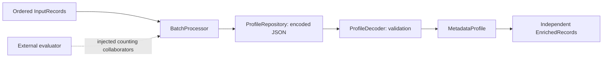

# Metadata batch optimization

Optimize repeated metadata decoding in a batch enrichment pipeline while preserving ordering, validation, and error semantics.

The functional baseline retrieves and validates encoded JSON metadata for every record. This task asks for less repeated work when many records use the same profiles, while preserving errors, independent output values, and freshness on subsequent calls. Evaluator-owned checks measure both behavior and collaborator invocations; elapsed-time ratios do not decide acceptance.

```sh
# From the root checkout, using Python 3.12:
uv sync --locked
uv run --locked long-swe verify examples/metadata-batch-optimization/task.yaml
uv run --locked pytest tests/test_metadata_optimization_task.py -v
uv run --locked python examples/metadata-batch-optimization/benchmark/run_benchmark.py --json
```

The first command that verifies the baseline exits 1 because its efficiency contract is unmet. Read [specification.md](specification.md) for candidate requirements. The [maintainer notes](development-notes.md) contain repair analysis and measured results separately.

## Architecture



The starting repository has six modules: `models.py` defines value objects, `repository.py` owns encoded storage, `decoder.py` validates profiles, `processor.py` orchestrates enrichment, `errors.py` defines domain diagnostics, and `__init__.py` exports the API. Runtime dependencies are standard library only.

`start/tests/` contains developer tests for existing behavior. The installed evaluator, measurement script, and one-file reference overlay live outside `start/`. The reference validates solvability; acceptance does not compare candidate code with it.

## Work on a fresh copy

```sh
uv run --locked python examples/metadata-batch-optimization/prepare_task.py ../metadata-work
uv run --locked python -m pytest ../metadata-work/start/tests -c ../metadata-work/start/pyproject.toml
uv run --locked long-swe verify ../metadata-work/task.yaml
```

Inspect the modules and existing tests before changing `metadata-work/start/src/`. `prepare_task.py` refuses an existing destination or one inside this task. Framework verification copies the prepared source again, runs the installed evaluator in that copy, and cleans up. Use `--output-root` outside the source directory to retain trace/result evidence.

To check solvability:

```sh
uv run --locked python examples/metadata-batch-optimization/prepare_task.py ../metadata-reference --reference
uv run --locked long-swe verify ../metadata-reference/task.yaml
```

## Verification and failure modes

The strict version-1.0 JSON protocol is constructed from 19 actual evaluator test methods: 16 functional cases and three work-count cases. Subcases cover varied batch sizes, distinct-profile counts, validation failures, and processing-order boundaries. Count checks use injected collaborators and also check every output; they do not inspect source strings.

Common failures include caching only half the expensive path, confusing record IDs with profile IDs, returning grouped order, applying the wrong profile, processing past the first error, sharing mutable outputs, or hiding repository changes between calls. Six temporary incorrect implementations are checked automatically. A separate two-stage correct implementation is also accepted.

## Timing measurements

```sh
uv run --locked python examples/metadata-batch-optimization/benchmark/run_benchmark.py
uv run --locked python examples/metadata-batch-optimization/benchmark/run_benchmark.py --records 10000 --profiles 20 --repetitions 7 --warmups 2 --json
```

The external script makes fresh baseline/reference workspaces and uses separate controlled subprocesses. Fixed profiles contain 32 labels and 12 required fields. It times `enrich()` with `perf_counter_ns`, warms each implementation, checks complete outputs against independently constructed expectations after every run, and reports measured samples and their median. Input generation, process startup, repository construction, and output checking are outside the timing window. Work counters remain enabled in both implementations. Settings and results use strict Pydantic models.

CI executes a smaller 1,000-record/eight-profile measurement and checks structured output and exact counts. There is no required speedup ratio. The default larger workload provides the recorded local timing evidence.

These measurements characterize this synthetic workload on the reported environment. They are not production performance claims.

## Testing and limitations

The task-quality suite checks developer tests, strict service typing, expected baseline failures, three fresh reference runs, an alternative design, six weak variants, unchanged source bytes, preparation safeguards, and executable measurement output. Linux and Windows CI run it separately from the other two tasks and framework tests.

This is synchronous in-memory enrichment of a stable sequence. Outputs and per-call profile state consume memory proportional to batch/output size and distinct profiles. There is no streaming, bounded-memory output guarantee, concurrent-update support, or cross-call reuse requirement. Timing depends on the workload and machine load; baseline measurements run before reference measurements, which can introduce ordering bias.

Evaluator-owned assertions are external, but candidate code shares their Python process and host permissions. Fingerprints detect persistent evaluator edits, not malicious interpreter manipulation or transient restored writes. This uses the framework's cooperative local-code trust boundary and does not add hostile-code containment. Only synthetic fixtures and sanitized evidence are published.
