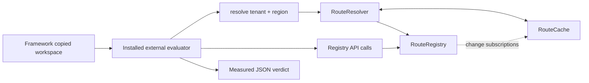

# Routing cache regression

Repair stale route resolution after runtime configuration changes in a hierarchical routing service.

This original synthetic debugging task starts with a working in-memory service: **10 developer tests pass**, initial routing follows the expected hierarchy, and repeated unchanged lookups work. A previously resolved request can nevertheless return an old destination after configuration changes. The external evaluator exposes the regression through real API calls.

From the framework checkout, using Python 3.12:

```sh
uv sync --locked
uv run python examples/routing-cache-regression/prepare_task.py ../routing-work
uv run pytest -c ../routing-work/start/pyproject.toml ../routing-work/start/tests
uv run long-swe verify ../routing-work/task.yaml
```

Choose a new destination outside the original task directory. The final command initially exits **1** with **3 evaluator methods passing and 14 failing**. Work in `../routing-work/start/`, reproduce the issue in [specification.md](specification.md), and repair the observable behavior without changing the public API.

## Existing system and architecture

The starting repository contains **10 files and six package modules, totaling 159 package lines**. It uses only the Python standard library at runtime. There is no external service or data store to provision.

| Module | Responsibility |
| --- | --- |
| `models.py` | Scope keys and configuration change records |
| `registry.py` | Mutable routes and change subscriptions |
| `resolver.py` | Request resolution and hierarchical fallback |
| `cache.py` | Previously resolved destination storage |
| `errors.py` | Missing-route domain exception |
| `__init__.py` | Public service exports |



Configuration precedence is **tenant-region > tenant-default > global-region > global-default**. The specification defines return values, validation, removal behavior, missing-route errors, and immediate visibility of every completed update. Repeated resolutions, newly added scopes, broader changes affecting several pairs, and transitions down the hierarchy must all obey that contract.

## Reproducing and debugging

Inspect the starting modules and developer tests, then reproduce an initial lookup followed by a configuration update and another lookup of the same pair. The baseline can store a new global destination B while continuing to return A for an already resolved pair. Also exercise the full fallback sequence TE → T → GE → G after consecutive removals.

The task is about observable correctness. No hit-rate, selective-entry-retention, particular cache representation, or advanced performance target is imposed. Different internal repairs are accepted. Preserve signatures, error attributes, exact string identity, independent registry state, and the existing developer tests.

## Evaluator ownership and protocol

`evaluator/src/routing_regression_evaluator/checks.py` contains **evaluator-owned behavioral verification kept outside the candidate workspace**. The code is public and inspectable. `uv sync --locked` installs it as a separate local development package. The task invokes `python -I -m routing_regression_evaluator`, which loads the operator-owned suite before importing the copied candidate package.

Seventeen unittest methods cover hierarchy precedence, cached updates at each scope, each removal level, repeated cycles, newly introduced routes, multiple affected entries, unrelated pairs, missing routes, multiple resolvers, and API compatibility. Subcases check several pairs without counting a method more than once. Counts come from actual test execution; no human test output is scraped.

The evaluator emits one strict version-1.0 JSON document. It does not discover candidate tests, load their `conftest.py`, read candidate result files, or match candidate source strings. Ordinary candidate prints are discarded during test execution. The framework still enforces process timeout, output bounds, exit-code agreement, and protocol validation.

This is controlled local execution, not hostile-code containment. The evaluator and candidate Python share a process, and code retains host permissions. Source fingerprints detect persistent evaluator modifications, but cannot prevent transient restored changes or interpreter manipulation. Review the root [trust boundary](../../SECURITY.md).

## Reference and task-quality validation

The reference is a two-file overlay outside `start/`. It is used only to validate task solvability and is never read by acceptance verification. Repair analysis is separated into [maintainer development notes](development-notes.md); the candidate specification does not identify the defect or prescribe a repair.

```sh
uv run python examples/routing-cache-regression/prepare_task.py ../routing-reference --reference
uv run pytest -c ../routing-reference/start/pyproject.toml ../routing-reference/start/tests
uv run long-swe verify ../routing-reference/task.yaml
uv run pytest tests/test_routing_regression_task.py -v
```

The reference preserves **10/10 developer tests** and passes **17/17 evaluator methods**. Three fresh reference runs agree in verdict and counts. A different correct implementation also passes all developer/evaluator checks. Six temporary incomplete repairs are rejected for specific behavioral failures. Task-quality checks compare source fixture bytes before and after execution and run strict mypy on the baseline and both accepted repairs.

Framework verification creates real `trace.jsonl` and `result.json` artifacts outside the task directory. `long-swe replay PATH` reads the saved evidence without executing commands. [Development notes](development-notes.md) include sanitized excerpts from actual runs; full machine-specific runtime artifacts are not committed.

## Difficulty and limitations

The reasoning spans registry mutations, request resolution, cached state, and fallback dependencies. The codebase stays small so difficulty comes from following the lifecycle across modules and preserving behavior, rather than navigating volume or ambiguous requirements. Difficulty has not been calibrated with participant data.

The service is synchronous and in-memory. Concurrent calls, listener teardown, bounded cache capacity, persistent configuration, and performance guarantees are outside this task. Each resolver owns its cache; sharing one cache across different registries is unsupported. Timing varies by host. The evaluator establishes the specified behavioral cases, not exhaustive correctness or malicious-code safety.
