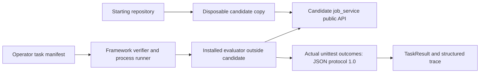

# Tenant quota feature

Add tenant-aware active-job quota enforcement to an existing job-processing service while preserving its public API and current scheduling behavior.

This original synthetic task asks you to extend a working Python service across configuration, submission policy, and domain errors. It requires reasoning about current repository state, tenant independence, lifecycle transitions, and rejection without partial persistence. The starting repository's **11 developer tests pass**; the requested quota feature is absent.

From the framework checkout, using Python 3.12:

```sh
uv sync --locked
uv run python examples/tenant-quota-service/prepare_task.py ../quota-work
uv run pytest -c ../quota-work/start/pyproject.toml ../quota-work/start/tests
uv run long-swe verify ../quota-work/task.yaml
```

The destination must be new. The final command initially exits **1**, with **1 evaluator case passing and 13 failing**, because quotas are not implemented. Work in `../quota-work/start/`, then repeat verification. `uv sync --locked` installs the separate local evaluator package as a development dependency; it requires no network API at execution time. The first dependency installation may require downloads.

## Scenario and existing system

The service stores immutable job snapshots in an insertion-ordered in-memory repository. Submission creates PENDING jobs; workers use explicit status transitions. Tenant filtering, payload snapshots, sequential IDs, error types, and scheduling behavior are already observable API contracts.

Start with [the specification](specification.md), then inspect `start/src/job_service/`:

| Module | Existing responsibility |
| --- | --- |
| `models.py` | Job snapshots, statuses, input validation, transition rules |
| `repository.py` | Creation, lookup, filtering, snapshot replacement, IDs |
| `service.py` | Public submission and lifecycle API |
| `config.py` | Construction-time service options |
| `errors.py` | Domain exceptions |
| `__init__.py` | Public exports |

The starting repository has nine files: six package modules, two developer test files, and `pyproject.toml`. There is no web framework, database, or external service to configure.

## Requested feature and boundaries

Add a default active-job limit and tenant overrides. PENDING and RUNNING count; all three terminal statuses do not. A rejected submission must leave storage and the next ID unchanged. Capacity is determined from the current repository, including sequential calls through services sharing it.

Keep existing API signatures, return values, tenant identity semantics, ordering, snapshot behavior, validation errors, and scheduling rules except for the explicitly requested quota restriction. The specification defines the configuration and exception API extensions without prescribing an internal architecture. Concurrent calls, runtime configuration reload, persistent storage, and scheduling changes are out of scope.

## Architecture and verification ownership



`evaluator/src/tenant_quota_evaluator/checks.py` contains **evaluator-owned behavioral verification kept outside the candidate workspace**. These tests are public and inspectable. The command `python -I -m tenant_quota_evaluator` selects the operator-installed package before adding the copied candidate's `src/` to its import path. It does not discover candidate test files, load their `conftest.py`, or read candidate result reports.

The evaluator runs 14 unittest methods, with subcases for relevant limits and statuses. A method with several failing subcases counts once as failed. Counts come from actual unittest execution, with no console-output scraping. The evaluator emits one strict version-1.0 JSON document. Ordinary candidate prints are discarded; failures report behavioral case names. The framework still validates protocol completeness, exit status, capture bounds, and timeout.

Deleting developer tests or writing a success report cannot satisfy these assertions. Before/after fingerprints detect persistent changes to evaluator source files. This is not hostile-code containment: evaluated Python retains host permissions and can manipulate its interpreter or filesystem. Fingerprints cannot stop transient tampering, restored modifications, or malicious native code. See [task development](development.md) and the root [trust model](../../SECURITY.md).

## Common failure categories

- Counting job history instead of active states, or releasing capacity on PENDING → RUNNING.
- Applying a global limit, ignoring a tenant override, or treating zero as unlimited.
- Allowing one extra job, persisting before checking, or consuming IDs on rejection.
- Keeping stale per-service counts after status changes or shared repository updates.
- Accepting invalid configuration, changing exception behavior, or breaking snapshots and scheduling.

## Reference validation

The reference implementation is an independent solvability check. It is outside `start/` and consists only of the three replacement files needed to implement the feature. The evaluator never reads it or compares candidate code with it.

```sh
uv run python examples/tenant-quota-service/prepare_task.py ../quota-reference --reference
uv run pytest -c ../quota-reference/start/pyproject.toml ../quota-reference/start/tests
uv run long-swe verify ../quota-reference/task.yaml
uv run pytest tests/test_tenant_quota_task.py -v
```

The reference keeps **11/11 developer tests passing** and passes **14/14 evaluator cases**. Task-quality tests repeat verification in three fresh framework workspaces, verify source bytes are unchanged, and reject five deliberately weak temporary variants. Both service variants also receive strict mypy checks. The CI task-validation step runs on Linux and Windows.

`verify` reports the saved artifact directory on stderr. Replay its `trace.jsonl` using `long-swe replay PATH`; it never reruns verification. No machine-specific result artifacts are checked in. [Development notes](development.md) include measured, sanitized trace excerpts and weak-variant outcomes.

## Difficulty and limitations

The target is roughly **20–45 minutes for a strong engineer**, an authoring estimate rather than measured participant data. The work is intentionally small; its difficulty comes from integrating state semantics with configuration and compatibility, not code volume or obscure syntax. Completion time and task difficulty have not been independently calibrated.

The reference recomputes current state on submission. It makes no throughput claim, has no concurrent check-and-insert guarantee, and retains job history in memory. Repeated verdicts are deterministic for these fixtures; elapsed times depend on the host. Tests demonstrate the documented cases, not exhaustive correctness for every possible implementation.
